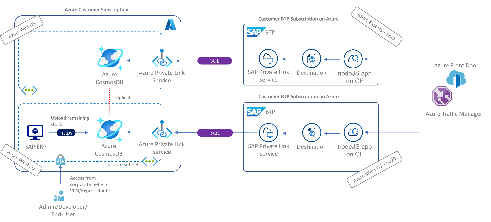

# Azure Cosmos DB with SAP Private Link quickstart sample

Example project showcasing a resilient **multi-region** app on SAP BTP powered by globally distributed **Azure Cosmos DB**. App was built upon the SAP Developer tutorial [Create a Node.js Application via Cloud Foundry Command Line Interface](https://developers.sap.com/tutorials/btp-cf-buildpacks-node-create.html) and the SAP Private Link for [Cosmos DB](https://help.sap.com/docs/PRIVATE_LINK/42acd88cb4134ba2a7d3e0e62c9fe6cf/663ed5631cfd4ef0a4bd89ca00266943.html). It relies on [Fastify](https://www.fastify.io/) instead of [Express](https://expressjs.com/) for a leaner setup.

This repos sheds light on the private connectivity aspect. To complete your resiliency journey, have a look at **intelligent routing** in this joint Microsoft+SAP [Discovery Center mission](https://discovery-center.cloud.sap/missiondetail/3603/) and this [blog post](https://blogs.sap.com/2021/06/11/sap-where-can-i-get-toilet-paper-an-implementation-of-the-geodes-pattern-with-s4-btp-and-azure-cosmosdb/).

## Getting started 🚀

Create `SampleDB` from **Quick Launch wizard** in Cosmos DB on the [Azure portal](https://portal.azure.com/?feature.customportal=false#view/HubsExtension/BrowseResource/resourceType/Microsoft.DocumentDb%2FdatabaseAccounts).

Create a [SAP Private Link for Cosmos DB](https://help.sap.com/docs/PRIVATE_LINK/42acd88cb4134ba2a7d3e0e62c9fe6cf/663ed5631cfd4ef0a4bd89ca00266943.html) named cosmos-pls or rename service in [manifest.yml](manifest.yml)

```cmd
cd app
npm install
npm start
```

Navigate to the addresses tab and enjoy the private response from Cosmos🪐☄️

## Deploy to BTP 🪂

Adjust route in manifest.yml as per [SAP's recommendation](https://developers.sap.com/tutorials/btp-cf-buildpacks-node-create.html) in step 2.

```cmd
cf push
```

## Full blown setup 🌏

This repos sheds light on the private connectivity aspect only. Learn more about intelligent routing in this joint Microsoft+SAP [Discovery Center mission](https://discovery-center.cloud.sap/missiondetail/3603/) and this [blog post](https://blogs.sap.com/2021/06/11/sap-where-can-i-get-toilet-paper-an-implementation-of-the-geodes-pattern-with-s4-btp-and-azure-cosmosdb/).



## Contributions and community work 👩🏼‍🤝‍👨🏽

Follow [this thread](https://github.com/sapmentors/cds-pg/issues/355) to stay up to date with CDS for Azure CosmosDB and SAP CAP driven by the amazing SAP Mentors. Feel free to comment under the associated blog posts or create [issues](https://github.com/MartinPankraz/sap-nodejs-on-cosmosdb-app/issues) here on GitHub.
