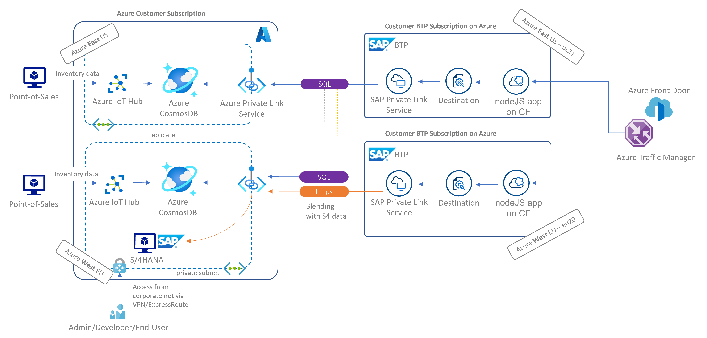

# Azure Cosmos DB with SAP Private Link quickstart sample

Example project showcasing a resilient **multi-region** app on SAP BTP powered by globally distributed **Azure Cosmos DB**. App was built upon the SAP Developer tutorial [Create a Node.js Application via Cloud Foundry Command Line Interface](https://developers.sap.com/tutorials/btp-cf-buildpacks-node-create.html) and the SAP Private Link for [Cosmos DB](https://help.sap.com/docs/PRIVATE_LINK/42acd88cb4134ba2a7d3e0e62c9fe6cf/663ed5631cfd4ef0a4bd89ca00266943.html). It relies on [Fastify](https://www.fastify.io/) instead of [Express](https://expressjs.com/) for a leaner setup.

This repos and associated [📝blog post](https://blogs.sap.com/2023/01/27/sap-private-linky-swear-with-azure-global-scale-with-azure-cosmos-db-with-sap-private-link/) shed light on the private connectivity aspect. To complete your resiliency journey, have a look at **intelligent routing** in this joint Microsoft+SAP [Discovery Center mission](https://discovery-center.cloud.sap/missiondetail/3603/) and this [blog post](https://blogs.sap.com/2021/06/11/sap-where-can-i-get-toilet-paper-an-implementation-of-the-geodes-pattern-with-s4-btp-and-azure-cosmosdb/).

## Getting started 🚀

Create `SampleDB` from **Quick Launch wizard** in Cosmos DB on the [Azure portal](https://portal.azure.com/?feature.customportal=false#view/HubsExtension/BrowseResource/resourceType/Microsoft.DocumentDb%2FdatabaseAccounts).

Create a [SAP Private Link for Cosmos DB](https://help.sap.com/docs/PRIVATE_LINK/42acd88cb4134ba2a7d3e0e62c9fe6cf/663ed5631cfd4ef0a4bd89ca00266943.html) named cosmos-pls or rename service in [manifest.yml](manifest.yml)

Run SAP Business Application Stuido or compatible IDE of your choice (I like [GitHub Codespaces](https://github.com/features/codespaces) for ready to run environments).

```cmd
git clone https://github.com/MartinPankraz/sap-nodejs-on-cosmosdb-app.git
cp templates/.env app
```

Maintain your cosmos credentials in the `.env` file. From Cosmos DB UI navigate to Settings -> Keys -> read-write Keys -> Primary Key.

```cmd
cd app
npm install
npm start
```

Navigate to the addresses tab and enjoy the private response from Cosmos🪐☄️

> **Warning** - when executing **locally** you need a connection to your SAP Private Link service (remember Cosmos is not publicly reachable!). Have a look [here](https://blogs.sap.com/2021/10/05/btp-private-linky-swear-with-azure-how-do-i-debug-and-test-with-live-data/) how to use ssh with cf.

## Deploy to BTP 🪂

Adjust route in manifest.yml as per [SAP's recommendation](https://developers.sap.com/tutorials/btp-cf-buildpacks-node-create.html) in step 2.

```cmd
cf push
```

## Full blown setup 🌏

This repos sheds light on the private connectivity aspect only. Learn more about intelligent routing in this joint Microsoft+SAP [Discovery Center mission](https://discovery-center.cloud.sap/missiondetail/3603/) and this [blog post](https://blogs.sap.com/2021/06/11/sap-where-can-i-get-toilet-paper-an-implementation-of-the-geodes-pattern-with-s4-btp-and-azure-cosmosdb/).



Above architecture can be considered a mix of high-availability and failover concepts. How so? The SAP Private Link in each BTP CloudFoundry space is configured to be able to reach both Cosmos regions and the app layer responds to the end-user as per the intelligent routing setting (fastest, closest etc.).

Learn more about Azure IoT and Cosmos DB [here](https://learn.microsoft.com/azure/architecture/solution-ideas/articles/iot-using-cosmos-db).

Consider the [ABAP SDK for Azure](https://github.com/microsoft/ABAP-SDK-for-Azure) for additional interaction scenarios with Cosmos DB.

## Learn more about available database spectrum for SAP Private Link scenarios

> **Note** - Primary purpose of this Database comparison is to fuel **your own investigation** with no ambition to be extensive.

Lear more about choosing an API for Azure Cosmos DB [here](https://learn.microsoft.com/azure/cosmos-db/choose-api).

| Database | Type | SAP Private Link enabled | Hosted on BTP/customer’s Azure env | Supported by [SAP CAP](https://cap.cloud.sap/docs/) natively |
|---|---|---|---|---|
| [HANA Cloud](https://discovery-center.cloud.sap/serviceCatalog/sap-hana-cloud?region=all&tab=service_plan&provider=azure&commercialModel=cpea) | Managed, closed-source, in-memory db service for relational, graph, spatial and document structures | Not yet | Yes/No | Yes |
| [PostgreSQL, hyperscaler option](https://discovery-center.cloud.sap/serviceCatalog/postgresql-hyperscaler-option?region=all&tab=service_plan&provider=azure&commercialModel=cpea) | Managed, open-source object-relational db service | No, but [private VNet integration](https://help.sap.com/docs/PostgreSQL/b3fe3621fa4a4ed28d7bbe3d6d88f036/b045b64925a544689dd839266a23c89b.html?locale=en-US#features) instead | Yes/No | No -- [community offering](https://github.com/sapmentors/cds-pg) hosted by SAP Mentors |
| [Redis, hyperscaler option](https://discovery-center.cloud.sap/serviceCatalog/redis-hyperscaler-option?region=all&tab=service_plan&provider=azure&commercialModel=cpea) | Managed, open-source in-memory data store for caching, streaming and message broker | No -- [private VNet integration](https://help.sap.com/docs/Redis/082005ec29494234a42af221bc963a67/71399a37ccba45c5b41d35f5ba9490dc.html?locale=en-US#features) instead | Yes/No | No |
| [Azure Database for MySQL](https://learn.microsoft.com/azure/mysql/single-server/overview) - single server<sup>1</sup> | Managed, open-source, traditional relational db | [yes](https://blogs.sap.com/2022/01/12/btp-private-linky-swear-with-azure-connecting-to-cheap-paas-dbs-with-private-link-service/) | No/Yes | No -- [community offering](https://github.com/Soontao/cds-mysql) by Theo Sun |
| [Azure Database for Maria DB](https://learn.microsoft.com/azure/mariadb/overview)<sup>1</sup> | Managed, open-source, traditional relational db | [yes](https://blogs.sap.com/2022/01/12/btp-private-linky-swear-with-azure-connecting-to-cheap-paas-dbs-with-private-link-service/) | No/Yes | No -- [community offering](https://github.com/Soontao/cds-mysql) by Theo Sun |
| [Azure Cosmos DB](https://learn.microsoft.com/azure/cosmos-db/introduction) (serverless)<sup>2</sup> | Managed, closed source, NoSQL and relational database for modern app development, highly responsive, globally distributed | [yes](https://learn.microsoft.com/azure/cosmos-db/how-to-configure-private-endpoints#private-zone-name-mapping) | No/Yes | No, but in [discussion](https://github.com/sapmentors/cds-pg/issues/355) with SAP Mentors and community |
| [Azure Cosmos DB](https://learn.microsoft.com/azure/cosmos-db/introduction) (provisioned throughput)<sup>2</sup> | See line before | [yes](https://learn.microsoft.com/azure/cosmos-db/how-to-configure-private-endpoints#private-zone-name-mapping) | No/Yes | No, but in [discussion](https://github.com/sapmentors/cds-pg/issues/355) with SAP Mentors and community |
| [Azure Cosmos DB for PostgreSQL](https://learn.microsoft.com/azure/cosmos-db/postgresql/introduction) | Managed service for PostgreSQL extended with the Citus [open source](https://github.com/citusdata/citus) superpower of distributed tables | [Not](https://learn.microsoft.com/azure/cosmos-db/postgresql/howto-private-access) yet | No/Yes  | No, conflicts with PostgreSQL, hyperscaler option |
| [Azure Cosmos DB for MongoDB](https://learn.microsoft.com/azure/cosmos-db/mongodb/introduction)<sup>3</sup> | Managed, MongoDB API compliant flavour of Cosmos | [yes](https://learn.microsoft.com/azure/cosmos-db/how-to-configure-private-endpoints#private-zone-name-mapping) | No/Yes | No |
| [Azure Cosmos DB for Apache Cassandra](https://learn.microsoft.com/azure/cosmos-db/cassandra/introduction)<sup>3</sup> | Managed, Cassandra API compliant flavour of Cosmos | [yes](https://learn.microsoft.com/azure/cosmos-db/how-to-configure-private-endpoints#private-zone-name-mapping) | No/Yes | No |
| [Azure Cosmos DB for Apache Gremlin](https://learn.microsoft.com/azure/cosmos-db/gremlin/introduction)<sup>3</sup> | Managed, Gremlin API compliant flavour of Cosmos, massive graph database service | [yes](https://learn.microsoft.com/azure/cosmos-db/how-to-configure-private-endpoints#private-zone-name-mapping) | No/Yes | No |

<sup>1</sup> General Purpose, Gen5 2 vCore

<sup>2</sup> [Request Units](https://learn.microsoft.com/azure/cosmos-db/request-units) need to be understood for a proper comparison. Also paritioning strategy impacting number of requests.

> **Note**:
> Check the [SAP Estimator](https://discovery-center.cloud.sap/estimator/?commercialModel=cpea) and [Azure Pricing Calculator](https://azure.microsoft.com/pricing/calculator/) to get a ballpark overview on pricing details.

As you can see there is a variety of choice of data bases for your BTP app with different capabilities and implications. The associated [blog post](https://blogs.sap.com/2023/01/27/sap-private-linky-swear-with-azure-global-scale-with-azure-cosmos-db-with-sap-private-link/) and prototype use [Azure Cosmos DB for NoSQL](https://learn.microsoft.com/azure/cosmos-db/introduction) in a multi-region setup with **provisioned throughput**.

## Contributions and community work 👩🏼‍🤝‍👨🏽

Follow [this thread](https://github.com/sapmentors/cds-pg/issues/355) to stay up to date with CDS for Azure CosmosDB and SAP CAP driven by the amazing SAP Mentors. Feel free to comment under the associated blog posts or create [issues](https://github.com/MartinPankraz/sap-nodejs-on-cosmosdb-app/issues) here on GitHub.
